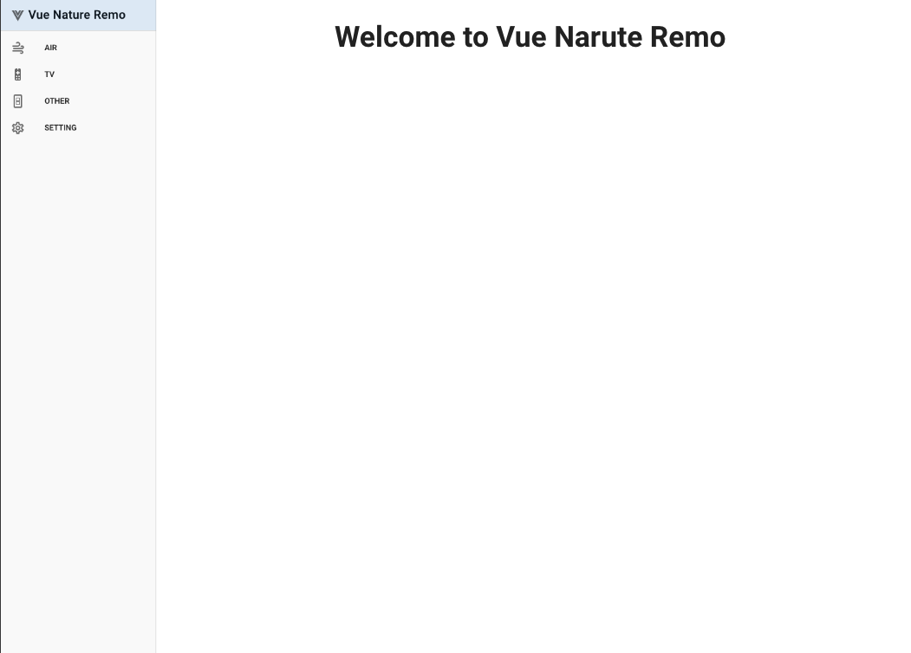
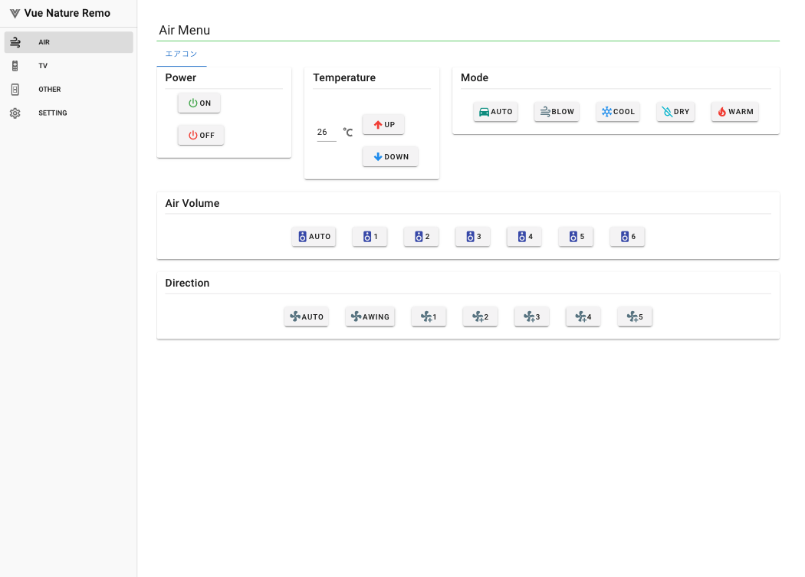
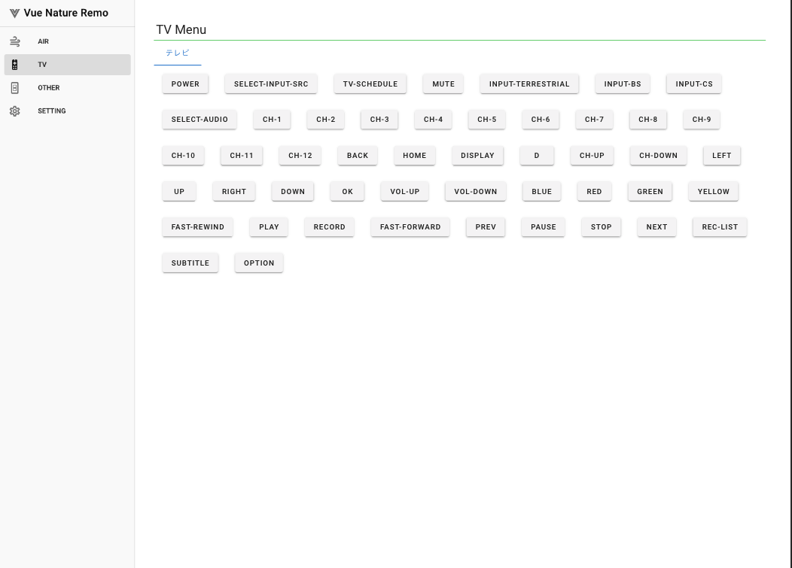
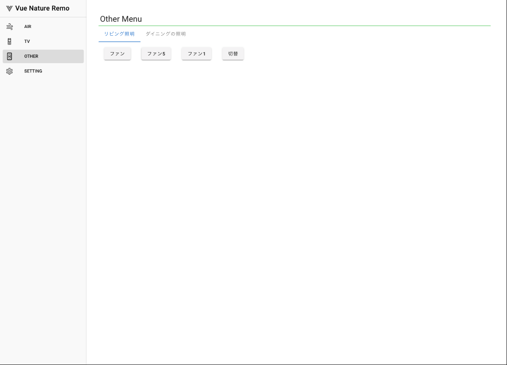
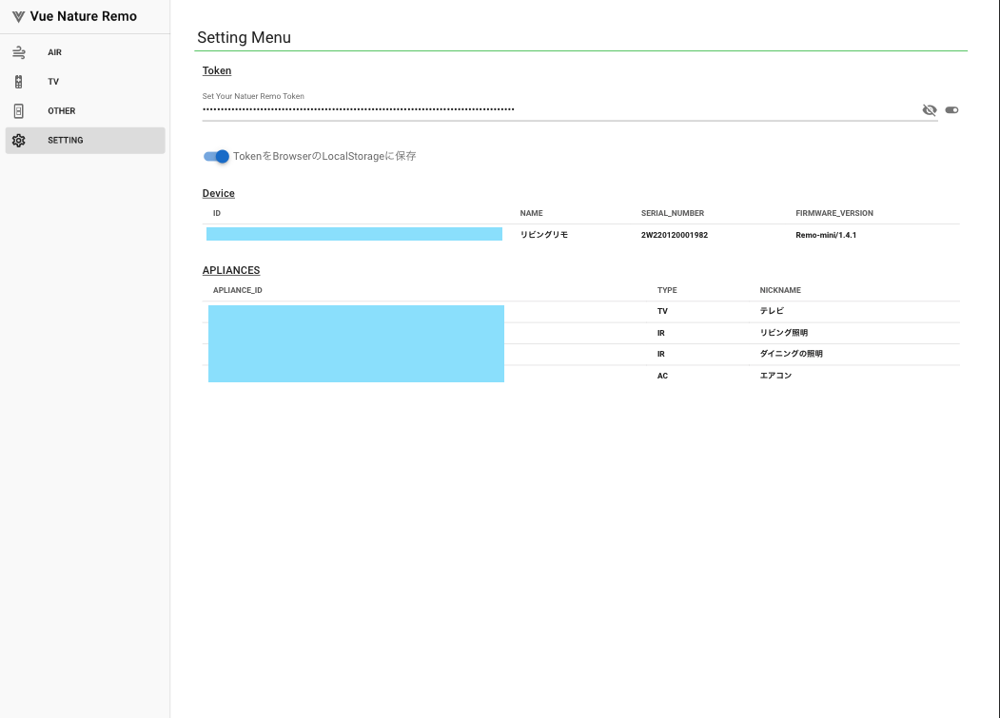

# vue-natuer-remo

Control Nature Remo Site<br>
Using Vue to control Nature Remo<br>

# Demo

- Save the api result as json the first time it is started.<br>
- This minimizes the number of connections, because it only makes api connections at send time instead of every time.<br>







# Quick Start

You can create the api token with the official site.<br>

official site<br>
https://home.nature.global/home

```bash
# clone repo
$ git clone https://github.com/n-guitar/vue-natuer-remo.git

# create docker image
$ docker build -t n-guitar/vue-natuer-remo .

# run container
$ docker run -it -p 8080:8080 --rm --name vue-natuer-remo n-guitar/vue-natuer-remo
```

# Versions tested

vue-src/package.json

# License

[MIT license](https://en.wikipedia.org/wiki/MIT_License).
